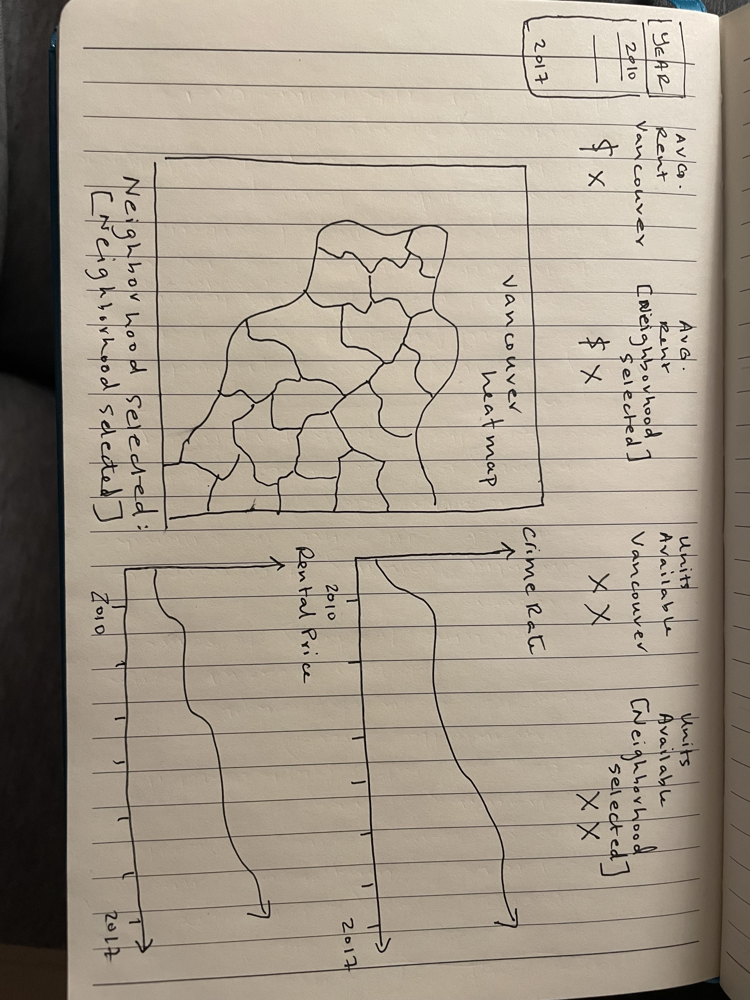

# Proposal for Project 3 Data Visualization Story:

## Team Members
- Zac Corbett
- Lynn Hoang
- Sameer Zubairi
- Christopher Yang 

## Beneficiaries/stakeholders
Newcomers to the city who are looking for a place to live/settle in for the first time. These are people who would be interested in understanding average rental and vacancy rates around the city, with a picture of crime in the area. 

Example scenario: A couple moving to Vancouver who wants to settle within Downtown. They want to determine rental price, and specific types of crimes they are worried about in that area, as well as historical information related to crime over the years and rent inflation.

## Visualizations 

#### Crime in the Vancouver Area
- [Dataset Link](https://www.kaggle.com/datasets/wosaku/crime-in-vancouver)
- Dropdowns/sorting: Type of crime, time (month/year)
- Types of Visualizations
    - Leaflet Marker Map
        - Function: User can zoom in on specific areas of map. This would show markers, and hovering over it can show the type of crime and time it was committed.
    - Bar/Line Graph
        - Function: Shows the crime rate from years 2010-2017 for chosen type and zoomed area of map
            - Optional: If possible, instead of zoomed area on map, make it based on neighbourhood. Would need neighbourhood data to be cleaned and matched with below CMHC data (geo-polygons)

#### Rent in the Vancouver Area
- [Dataset Link](https://www03.cmhc-schl.gc.ca/hmip-pimh/en/TableMapChart/Table?TableId=2.1.31.3&GeographyId=2410&GeographyTypeId=3&DisplayAs=Table&GeograghyName=Vancouver)
    - Dropdowns: time (year)
- Types of Visualizations
    - Leaflet map: Heatmap or choropleth based on rental prices for that neighbourhood
    - Metadata: Shows the avg rent, vacancy rates per dropdown criteria 
    - Bar/Line graph: Shows the rental rates from 2010-2017 for chosen neighbourhood. *Need name of graph to update to show specific neighbourhood it is referencing.

#### Dataset Cleaning Tasks:
- Reduce crime dataset to type, time, year, coordinates
- Reduce rent dataset to Neighbourhood, vacancy rate, average and median rent, # units
- Reduced years to 2010-2017
- Neighbourhoods have to be cleaned and matched between both datasets if Crime Rate is to be included (optional, time permitting for better graph and map integration)

## Product structure (Napkin Sketch)

## Outline of Plan/Tasks Required for Project
- All datasets need to be cleaned and put into CSV format
- CSV files to put into SQL database (via MongoDB)
- Python Flask API script to store and call data from the database
- JavaScript Visualizations
    - D3 for grabbing data from API
    - Leaflet for map
    - Plotly for Charts
    - Additional Metadata 
    - Need new library that wasn't shown in class
