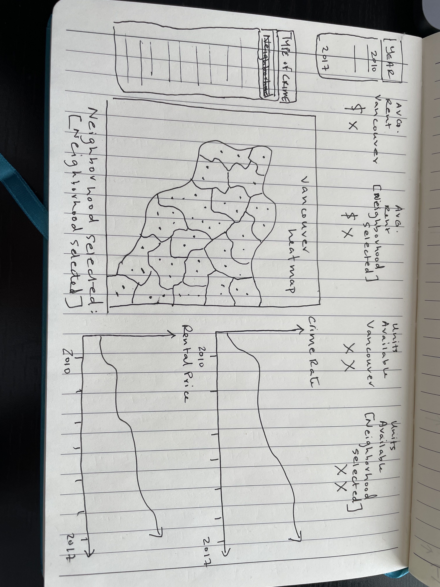

#Proposal:

##Team Members
- Zac Corbett
- Lynn Hoang
- Sameer Zubairi
- Christopher Yang 

##Three Visualizations 

- Leaflet Map: interactive heat based map of crime in the Vancouver area
Dataset: https://www.kaggle.com/datasets/wosaku/crime-in-vancouver
    - Dropdowns: Type of crime, time (month/year) 
        - Markers, clustered markers or heat map for crime
        - If Marker, hover over marker for details

- Economic Chart: Interactive Vancouver Rental Market Statistics Summary (CMHC)
    - Dataset: https://www03.cmhc-schl.gc.ca/hmip-pimh/en/TableMapChart/Table?TableId=2.1.31.3&GeographyId=2410&GeographyTypeId=3&DisplayAs=Table&GeograghyName=Vancouver
		- Yearly/Annual Only dataset
	- Dropdowns: Type of economic data
		- When displaying "year" on leaflet crime plot, highlight specific bar on Housing chart

- Pi Chart or similar (use of library from outside class?): show percentage breakdown of types of crime per timeframe
    - Given a timeframe from dropdown, show breakdown of crime type 

##Beneficiaries/stakeholders
Citizens and visitors who want to know how many crimes are committed in a specific area and what type. 
Citizens: Can determine if there is a prevalence of vandalism or house break-ins
Visitors: Can determine if there is a prevalence of petty theft and car break-ins

##Product structure (Napkin Sketch)

##Outline of Plan/Tasks Required for Project
- Kaggle CSV files to put into SQL database (via SQlite or MongoDB)
- Python Flask API script to store and call data from the database
- Data Cleaning steps:
    -If data is too big, reduce dataset through the following means:
        - Subtract columns (hour, day, x, y, neighbourhood)
        - Focus on smaller subset of years
        - Reduce dataset to specific neighbourhood radius rather than entire city
- JavaScript Visualizations
    - D3 for grabbing data from API
    - Leaflet for map
    - Plotly for Economic data
    - Plotly for crime percentage data
    - Need to find usage for one more library that was not discussed in class
